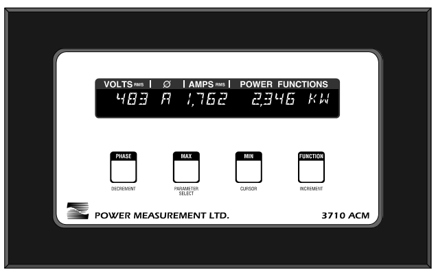
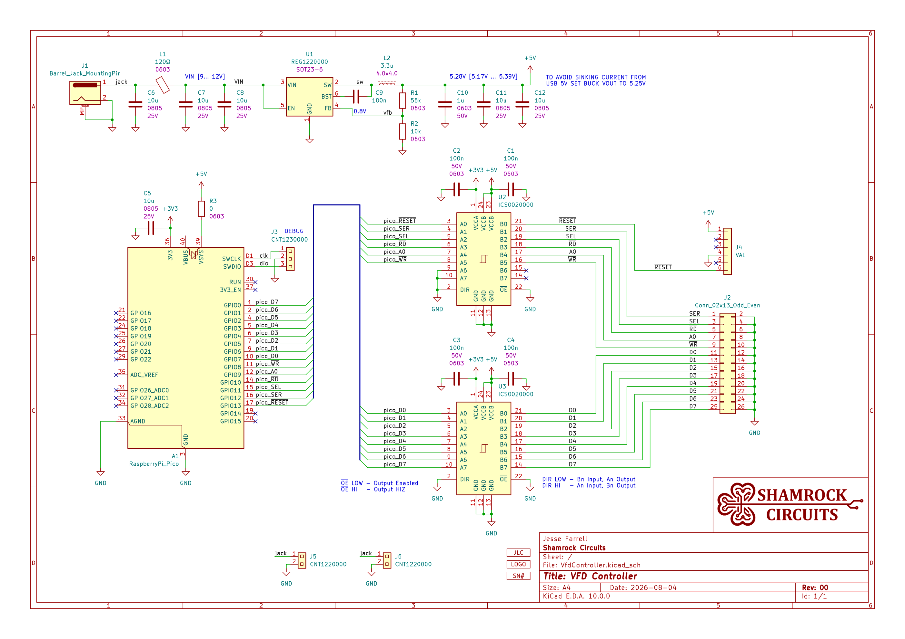
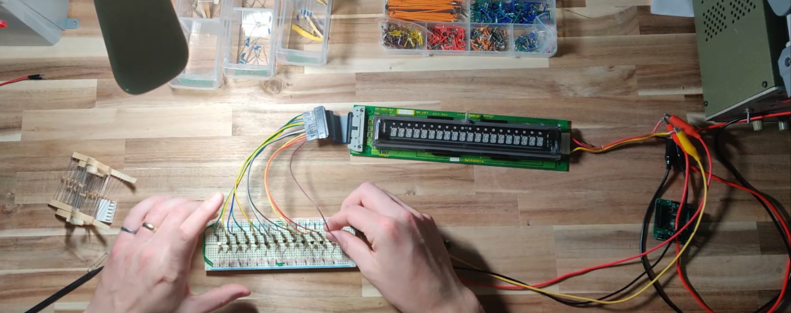
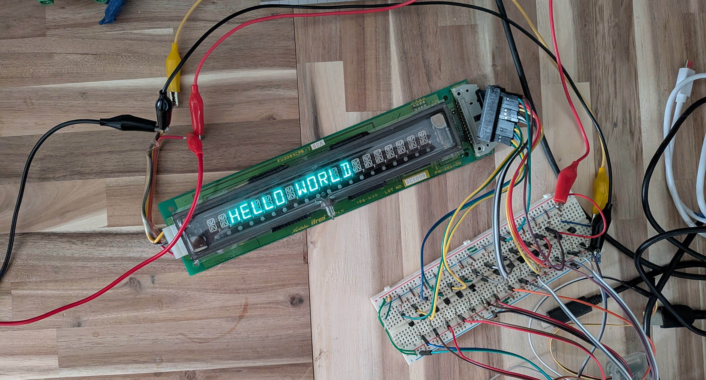
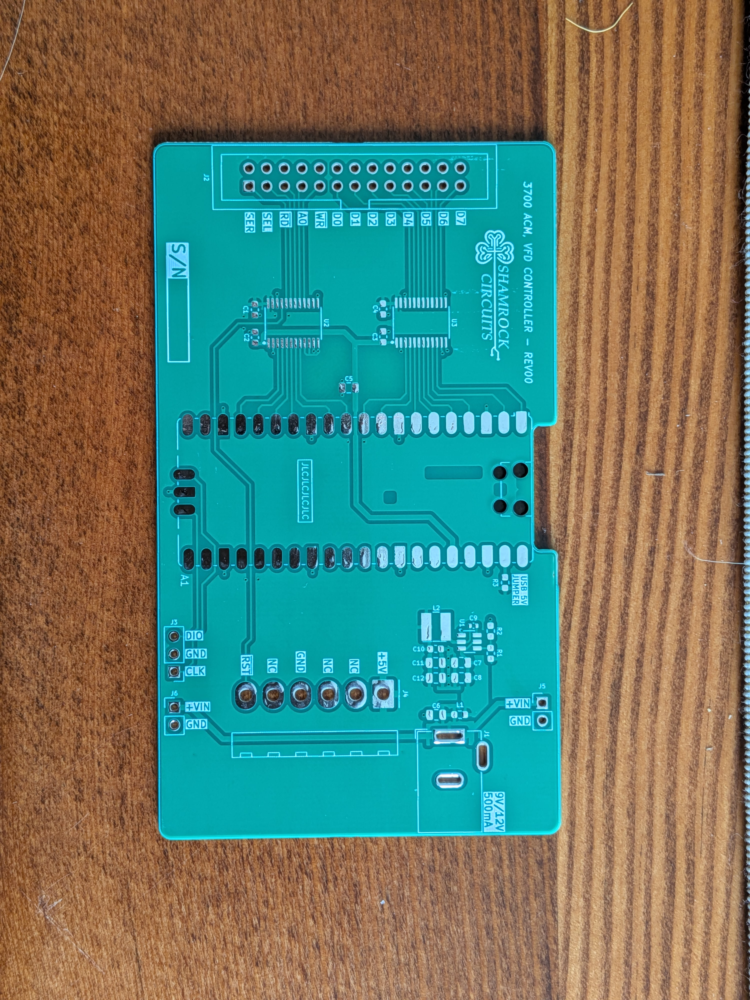
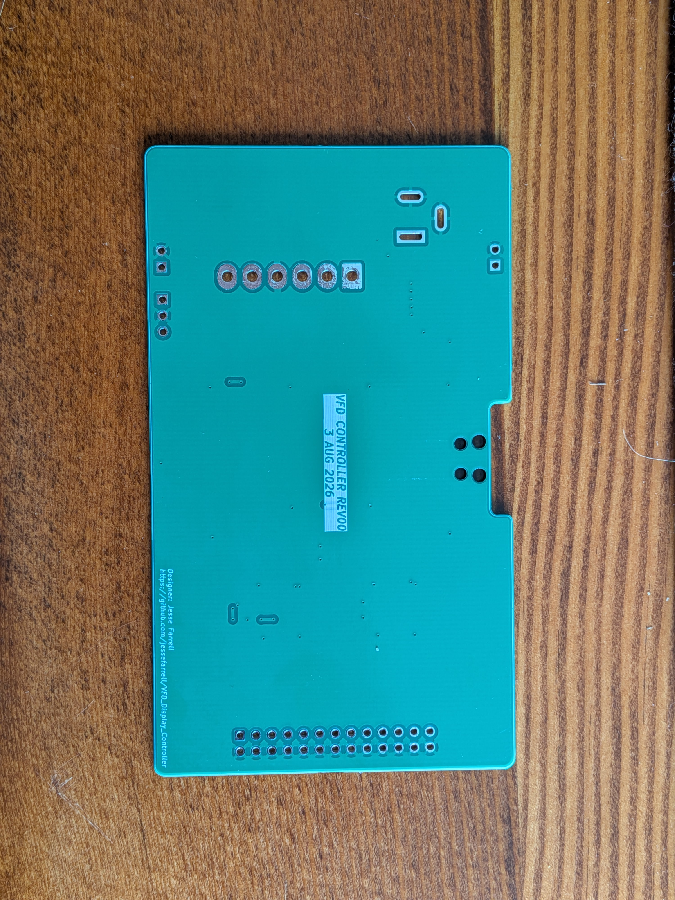

<!-- PROJECT LOGO -->
 

  

  <h1 align="center">VFD Module Controller - REV00</h1>

  

    The <a href="https://ckm-content.se.com/ckmContent/sfc/servlet.shepherd/document/download/0691H00000GYmavQAD">Power Measurement, ACM 3710</a> was a power meter released in 1989 which was discontinued in the "early 2000s". 
    These meters used an interesting, semi-custom, 20 character, 14 segment, Vacuum Fluorescent Display.
     
    I have five of these VFD modules floating around my parts bin... so I made this controller board to interfce with them.
     
     
    <strong>STATUS - IN PROGRESS</strong>
     
    <a href="https://youtube.com">View Demo</a> [PENDING]

  

## Introduction
<!-- High level overview of what the project is and does -->
This VFD module controller was designed around a VFD module that was originally integrated into the <a href="https://ckm-content.se.com/ckmContent/sfc/servlet.shepherd/document/download/0691H00000GYmavQAD">ACM 3710</a>. Exact model numbers of the module seem to vary, but as far as I can tell they are all interchangeable. This module is the **ISE Electronics Corp, FU209SCPB-S4A** or **FU209SCPB-T60A**, and they seem to be a custom (undocumented) model that is similar to  **CU209SCPB-T20A**. The purpose of this project is to convert the VFD modules parallel bus interface into something configurable over USB, and to possible develop a few applications for the display.

  
  

## Motivation
<!-- Why I bothered making this -->
I'm a sucker for 7-segment displays and other interesting displays in general. So 14 segments on a VFD easily got my attention from the bin. A short dumpster dive later I found myself the proud owner of 5 VFD modules. All of the hard work of interfacing with the display is managed by the module, but I still need a way of controlling the 8bit data bus from the comfort of my desk. The fact that so much of the work has been offloaded onto the VFD module itself, makes this whole thing a good candidate for a "quick weekend project"...

## Features
- USB Serial Control
- Command Line Interface
- Write Character or String
- Shift Displayed String
- Delete Character
- Clear Screen

## How it Works
<!-- IMAGE: Block diagram -->
This project could, in theory, be as simple as a microcontroller driving the various I/O pins of the VFD module. The module itself consumes about 430-460mA during normal operation, from a single 5V power input (the module then converts that to a higher voltage for the VFD), leaving just enough headroom in the 500mA (5 unit load) USB spec to power the controller board I'm designing. Some flavour of AVR microcontroller would have been a good fit here, but my bin full of Pi Pico's is looking for a project, meaning I'll need some logic level translators. I also decided to include an optional barrel jack power input incase I want to stack multiple VFD modules together, or if the USB port isn't able to provide the 500mA.
 
 
Instead of providing a block diagram, this project is small enough to just review the schematic (shown below).

  

## Gallery

<!-- IMAGE: 2-3 supporting shots — schematic snippet, PCB layout, alternate angle render -->

  
  
  
  

## Status
I received PCBs 8/16/2026, and I recently ordered the connectors. This project will probably be closed later this month.

## License

---

Designed by Jesse Farrell — [info@shamrockcircuits.com](mailto:info@shamrockcircuits.com)
